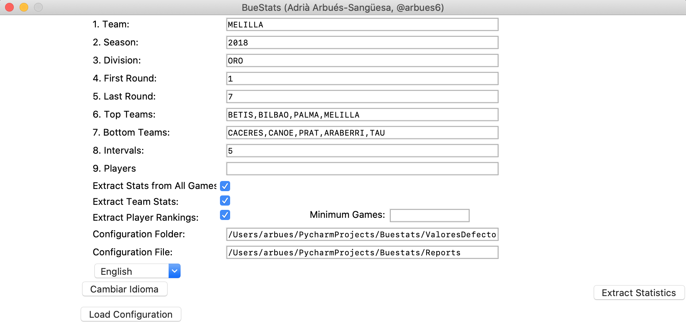

# 0. BueStats
Advanced statistics have proven to be a crucial tool for basketball coaches in order to improve training skills. Indeed, the performance of the team can be further optimized by studying the behaviour of players under certain conditions, thus NBA teams already created highly skilled data science departments to handle tons of information, such as tracking data or the output of other advanced computer vision algorithms. However, European teams are far behind in this field, and tracking data is completely otherworldly for the 97% of them, but the worst thing is that there is not an existing culture-data tradition, which creates the need for data. Coaches have a solid point when they say that their job includes not only practice preparation, but also video sessions, individual meetings, or even physical and conditioning stuff, so they have basically no time to start digging for data for a rough analysis a posteriori. 
The goal of BueStats is fulfilling these couple of gaps:
1. Provide coaches with a basic tool that automatically extracts advanced-statistics reports. 
2. Help coaches understand and handle data in order to create a natural habit. Reports' data will not have complex information, but game conditioning factors and metrics that are easy to understand (tutorials are coming soon!), as it is important to establish a solid numerical basis before moving forward. 

In particular, at the moment, BueStats can provide advanced statistics reports of FEB teams (Spanish Basketball Federation), which include any team/player from: 
- **Liga Femenina Endesa** (1st female Spanish division)
- **Leb Oro** (2nd male Spanish division)
- **Liga Femenina 2** (2nd female Spanish division)
- **Leb Plata** (3rd male Spanish division)
- **Liga EBA** (4th male Spanish division)

BueStats is a non-lucrative Python-based project out of the scope of my PhD, and it has been tested with Ubuntu 16.04, MacOS 10.15.2 and Windows 10. I really hope you like it! 

## 1. Requirements
### 1.a. ChromeDriver
BueStats does not only compute advanced basketball metrics, but it is also a web scraper that gets information from the HTML code of FEB websites (in a cool and legal way, of course). However, FEB's website is not that easy to scrap, given that there are dropdown menus that have to be changed, but these actions do not modify the general website link; for this reason, a remote browser controller has to be installed: [Chromedriver](https://chromedriver.chromium.org/). It is vital to install a Chromedriver version that matches your Google Chrome browser version, which can be find in Settings, and clicking About Chrome. Once installed, make sure that the downloaded chromedriver exectuable file is placed in the main BueStats folder. 

### 1.b. Python Dependencies
As exepected, some Open-Source Python libraries have to be installed as well for a proper running of this program. This dependencies are included in *Requirements.txt* in case you want to build a virutal environment; otherwise, these libraries can be easily installed with pip: 
```
pip3 install numpy
pip3 install selenium
pip3 install lxml
pip3 install pandas
pip3 install requests
pip3 install bs4
```

## 2. Interface
BueStats has a simple straight-forward interface (Stats_GUI) as seen in the following screenshot: 

- **1. Team / Equipo:** target team you want to scout or analyze. The name of the team must be a **single unique word** with no spaces belonging the the team original name; this is, the name of the team according to FEB. In the given example, Melilla's data will be extracted; note that Melilla is a unique team name, whereas "Baloncesto" or "Club" would not be. 
- **2. Season / Temporada:** season you want to scout; in this case, 2018 indicates the 2018-2019 season (2019 would indicate 2019-2020 and so on). 
- **3. Division / Categoria:** FEB division of the corresponding team. In order to unify groups and names, and bearing in mind that the program is case-sensitive, the following nomenclature has to be followed: 
  - **3.a. Liga Femenina Endesa** can be written as *Endesa* or *LF*.
  - **3.b. Leb Oro** has to be written as *ORO*.
  - **3.c. Liga Femenina 2** has to be written as *LF2*, but given that there are 2 groups (A or B), the group must be included in the encoding after a comma: for example, *LF2,A* belongs to a team compeiting in the group A of Liga Femenina 2.
  - **3.d. Leb Plata** is by far the most complex one, as it has two competition phases: the first one is geographically defined (Este / Oeste), while the second one depends on the previous results (A2). For this reason, a basic encoding has to be followed: *PLATA,F1,F2* , where *F1* belongs to the first phase and can be *ESTE* or *OESTE*, and *F2* belongs to the second one and can be expressed as *A1* and *A2*. An example could be: *PLATA,ESTE,A1*, or *PLATA,OESTE,A2*. However, if you want to output data just from one phase, you should encode it as: *PLATA,F*, where *F* could be one of the mentioned options (*ESTE* / *OESTE* / *A1* / *A2*).  
  - **3.e. Liga EBA** has to be written as *EBA*, but as happened with Liga Femenina 2, the name of the group has to be included as well after a comma with either one or two characters: for instance, if the team plays in group C, which has division CA and division CB, the encoding would be *EBA,CA* or *EBA,CB*, but if the team plays in division B, which has no subdivisions, the encoding would be *EBA,B*.
- **4. First Round / Primera Jornada** is the first (included) round to be taken into account while extracting data.
- **5. Last Round / Última Jornada** is the last (included) round to be taken into account while extracting data.
- **6. Top Teams / Equipos Top** (optional) can be filled with the top teams of the competition, which might help to see how players perform against powerful teams. The set of teams has to be included with commas and no spaces. 
- **7. Bottom Teams / Equipos Cola** (optional) can be filled with the bottom teams of the competition. It has to be mentioned that both Top and Bottom Teams might be filled with any set of teams as well (all sizes). 
- **8. Intervals / Intervalos** will pack the performance of players/team in groups of N games, being N the number written in Intervals text box. For instance, if we split in groups of 5 the performance of a team that has played 13 games, statistics are separated for the 1-5, 5-10, and 10-13 games. 
- **9. Players / Jugadores** (optional) can be filled with a set of players that you want to scout by writting unique surnames. For example, both Josep Franch De Pablo and Felipe Dos Anjos De Paula play in Melilla; if we write *FRANCH* in the text box, only stats from Josep Franch will be extracted, whereas if we write *DE*, the performance of both players will be analyzed (De Pablo / De Paula). Again, more than one player can be added: (i.e) *FRANCH, AGADA*. 
- **Extract All Rounds / Extraer Todas las Jornadas** is a checkbox that (when checked) extracts the stats of the analyzed players for every single game in the given season.
- **Extract Team Stats / Extraer Estadísticas de Equipo** is a checkbox that (when checked) extracts statistics not only at a player-level but also at a team-level. 
- **Extract Rankings / Extraer Rankings** is a checkbox that (when checked) extracts sorted rankings of the given team for each particular stat. This checkbox is related with the Textbox of **Minimum Games / Minimo Partidos** (optional), which can be set in order to set a threshold to include (or not to include) players in the rankings according to the games they have played; if the box is empty, this threshold is automatically set to half the number of games. 
- **Configuration Folder / Carpeta Configuración** (optional) will be explained in Section 4 (Configuration Files).
- **Output Folder / Carpeta Destino** is the path where the output files will be stored. By default, it is a folder called "Reports" in the same "BueStats" main folder (you might create it for simplicity). 
- **Change Language / Cambiar Idioma** switches languages between Spanish and English; not only the interface will be affected, but also the output result. 
- **Load Configuration / Cargar Configuración** will be also explained in Section 4 (Configuration Files).

Finally...
**Extract Statistics / Extraer Estadísticas** is the main button to start gathering data from FEB. Once you press this button, you just have to be a little patient; Chromedriver will keep popping up and closing FEB sites automatically while extracting information. **Don't interact with these windows**, but you can keep using your computer as usual.  

### Scouting the whole league! 
A "hidden" feature of BueStats (useful for scouts) is that not only teams and players can be analyzed, but also the entire league! For doing so, you just have to change the text in team for *LIGA* (in the given example, Melilla should be substituted by LIGA). Again, the names of players can be filtered as well. Please note that it might take a while to generate the outputs since there's much more information. 

## 3. Output

BueStats produces quite a bunch of outputs in a .csv format, don't be overwhelmed because of that! The main reason for generating different statistic files is that the criteria to handle data changes among coaches and analysts, so there is not a best nor established way to do it! For a better visualization of the results, I would strongly suggest to mix the output files as you desire in a Google Spreadsheet file (by importing data), using different sheets and fixing the first row and the first two columns.  <br/>
<br/>
All those files starting with a letter *p* belong to *Player* stats, whilst files starting with letters *t* and *r* correspond to *Team* and *Ranking* files. 
  - The files that does NOT end with *Phases.csv* or *Rounds.csv* contain all player/team stats depending on several game-conditioning factors, such as Home / Away, Won / Lost, Initial-5 / Bench, Easy / Tough, Last3 games, and even the performance of the player against the desired teams included in Top/Bottom teams. 
  - The files that end with *Phases.csv* contain the player/team stats clustered into the N-game groups indicated in the above-mentioned intervals.
  - The files that end with *Rounds.csv* contain the performance of the player/team in each round of the season. 
  - Rankings (file that starts with *r*) includes the sorting of players from better to worst. <br/>

Apart from the game conditioning factors, the following advanced statistics are included: <br/> 
- **Player Level**: playerAST%. eFG%, TS%, GScored, Possessions, Floor Percentage, Points per Shot, %REB, %DRB, %ORB, STL%, Touches, Versatility, Usage, Win Scores, OER, DER, Net Points.  
- **Team Level**: Pace, OER, DER, eFG%, TS%,Play%, FTR%, %DRB, %ORB, %ASST, %TOV.  
  

## 4. Configuration Files
The amount of filters and text boxes of BueStats is not small, and since the whole purpose of building this program is to automatize processes, configuration files might be used in order to save time. This files are simple .txt files (such as the ones included, i.e. *ValoresDefectoORO.txt*), where you can set a default configuration and load it in the interface with a simple click; this feature might be useful for coaches that want to analyze their own team every single week. As it can observe, the text template follows this pattern:
```
team=UNICAJA
season=2018
division=EBA,DA
firstRound=1
lastRound=18
topTeams=MONTETUCCI,FRAMASA,JAEN
botTeams=NOVASCHOOL,MARBELLA,INTERIOR
intervals=7
players=
outputFolder=/mnt/DATA/FCBScrapping/Reports
```
By clicking the *Load Configuration* button (and making sure the *Configuration Folder* is properly set), the information in the text file is loaded. 

## 5. Plotting Interface
(NEW FEATURES! March 22nd)
As you might see, another GUI has been included in the source code (Graphics_GUI.py). 
Following the same nomenclature as the one seen in the previous Sections, simple 2D graphics with team logos can be extracted for any desired statistic (in both the X and Y axes), which can be classical ones / advanced / stats of the opponents. In order to do so, just create a folder called "Images" inside the existing "Reports" one (e.g. mkdir /mnt/DATA/FCBScrapping/Reports/Images) and copy and extract the images of "Logos.zip", which include (thanks to FEB and Muevetebasket) all 2019 logos splitted by divisions. 
Then, you just have to choose the desired rounds and statistics, and the plot will be automatically stored in your folder. Moreover, some npy files are also stored automatically to speed up the process. For instance, the first time you want to plot a specific graphic for (eg) 22 rounds, the scraper will browse around FEB website until getting all data; this process might take a while, but by storing these .npy arrays, it will be fully automatic the next time, without having to wait or whatsoever. Note that I included some default NPY files in a zip file (which are the ones corresponding to team data of some of the competitions before the covid-19 interruption).


## 6. Data Ownership
All extracted BueStats' data belong to the Spanish Basketball Federation (FEB) and their corresponding boxscores, which are available online only for non-lucrative purposes. Please cite this GitHub or BueStats ifself if you are using this tool for writing scientific publications or sports articles (researchers and journalists). 

## 7. Contact
You can reach me by email (adria.arbues@upf.edu) or by Twitter (@arbues6), and any suggestion or doubt will be kindly addressed! However, I have a thesis to finish in less than 2 years, so I won't have the chance of adding brand new features quickly. <br/>
Executable files for Mac, Windows, and Linux, and tutorials are available in my [UPF Website](https://www.upf.edu/web/adria-arbues/buestats).
